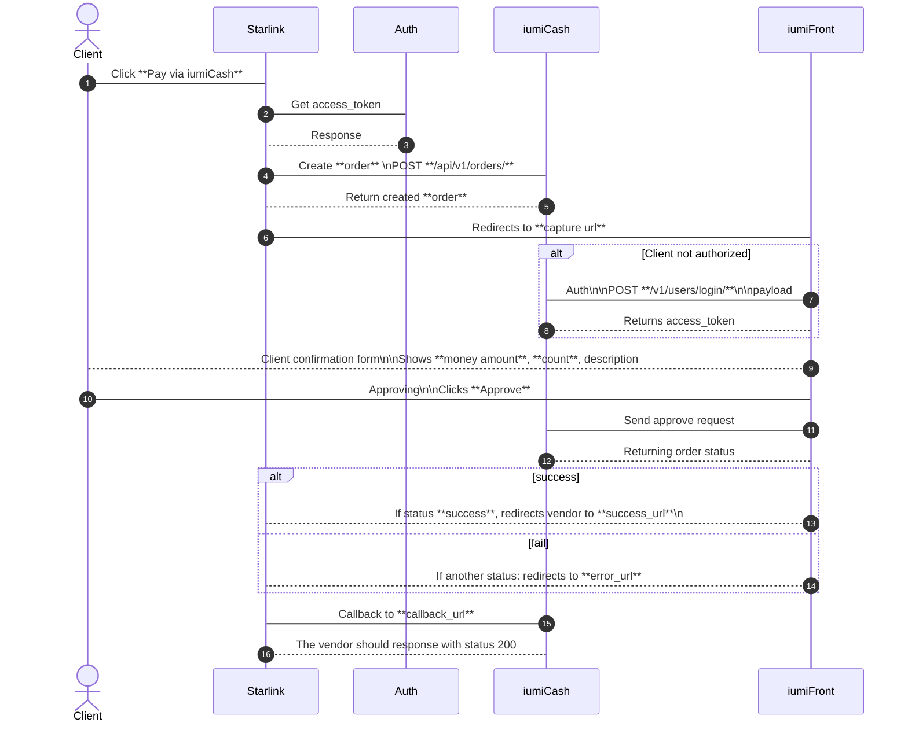

# One-Time payment flow

This sequence diagram shows how One-Time payment works.

```mermaid
sequenceDiagram
    autonumber

    actor Client

    participant Starlink
    participant Auth
    participant iumiCash
    participant iumiFront

    Client->Starlink:Click **Pay via iumiCash**

    Starlink->Auth:Get access_token
    Auth-->Starlink:Response

    Starlink->iumiCash:Create **order** \nPOST **/api/v1/orders/**
    iumiCash-->Starlink:Return created **order**


    Starlink->iumiFront: Redirects to **capture url**
    alt Client not authorized
    iumiFront->iumiCash: Auth\n\nPOST **/v1/users/login/**\n\npayload
    iumiCash-->iumiFront: Returns access_token
    end
    iumiFront-->Client:Client confirmation form\n\nShows **money amount**, **count**, description
    Client->iumiFront:Approving\n\nClicks **Approve**

    iumiFront->iumiCash:Send approve request
    iumiCash-->iumiFront:Returning order status
    alt success
    iumiFront-->Starlink:If status **success**, redirects vendor to **success_url**\n
    else fail
    iumiFront-->Starlink:If another status: redirects to **error_url** 
    end

    iumiCash->Starlink:Callback to **callback_url**
    Starlink-->iumiCash:The vendor should response with status 200

```
